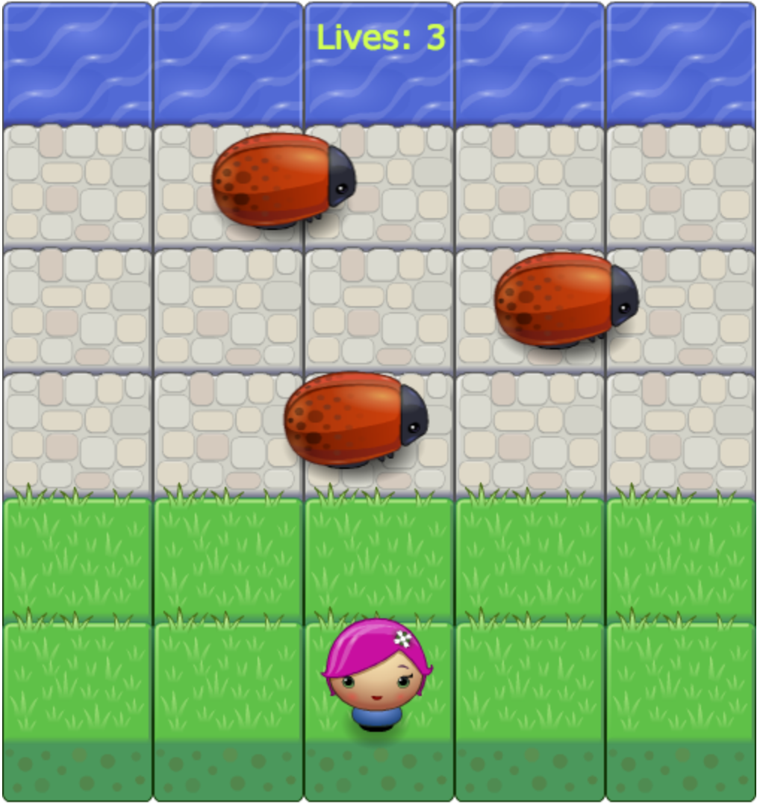

# Udacity Arcade Game
This is the tipical froger game  we played as children, is simple but really fun!.
## Instalation
To run the application please download or fork the project from my [Github](https://github.com/pedromoralesc/frontend-nanodegree-arcade-game) account and then proceed to open the index.html file in the internet browser of your choice. Follow the instructions bellow and enjoy!.

## Objective
Welcome to this simple but fun Arcade Game. The objective is to get your character to the water , once you reach the top edge of the screen you will get a congratulation screen. Remember you only have 3 lives to complete the game. 

## Instructions

* 1.Select your character using the pointer.
* 2.Use the arrow keys in your keyboard to move your character.
* 3.Avoid enemy contact, otherwise you will loose a live and your character will return to the beginning.
* 4.Reach the top edge of the screen to win the game.
* 5.Either you win or loose you will be given an option to continue with the previus selected character or to select another character, choose whatever you want but remember always to have fun!.

## Code explanation
This project is oriented to implement everything we learned about object oriented programming, so we wrapped all the information of the players and the enemies in objects, the game engine, provided by Udacity, was designed to work with both objects. We create a render function who draw in the HTML canvas the player character, the enemies and the background of the board. We also write a update function, who multiply the enemy speed by the delta time, which allows to render the game equal in every computer, despite their processing power. Update function also allows the enemies to reappear in the board ones they reach the left edge. It works the same with the player object.
We also write a function to handle the user key input so the character can move in every direction.
Thanks for playing it, and enjoy!.

## Code dependencies
In this app we use.
* 1.Jquery
* 2.Bootstrap
* 3.Images
* 4.HTML
* 5.CSS
* 6.JavaScript
